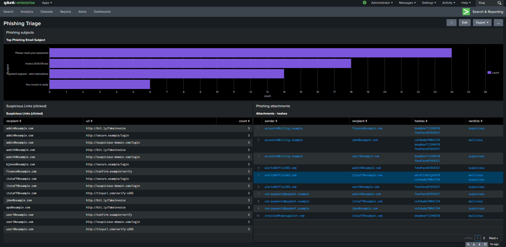
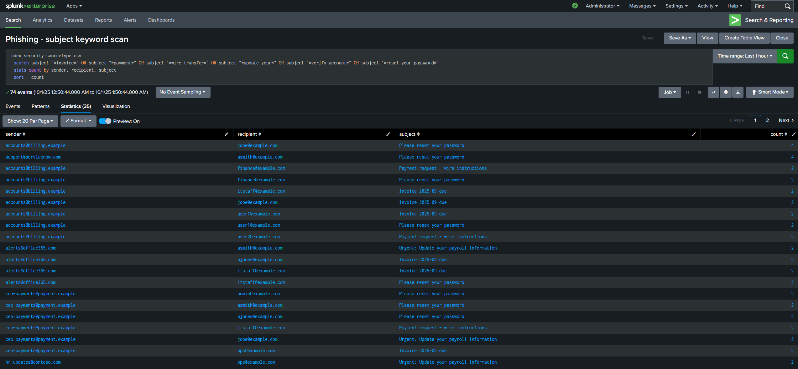
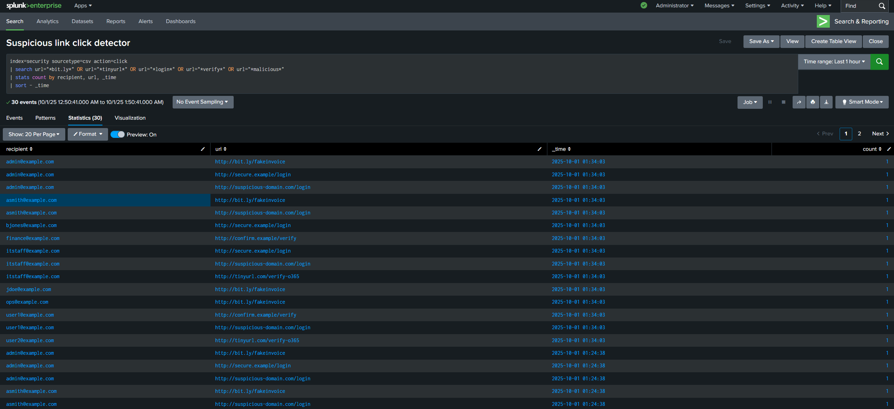

# Splunk Phishing Playbook

This repository contains a phishing incident response playbook, a one-page runbook, Splunk detection queries, and a synthetic dataset for testing.

## Contents
- `IR_Playbook.md` — Full playbook for phishing triage and containment.
- `IR_Runbook.md` — One-page runbook (checklist).
- `data/phishing_sample_events_large.csv` — Synthetic email events for testing (safe).
- `queries/*.spl` — Splunk queries for detection.
- `screenshots/` — Dashboard and alert screenshots (placeholders).
- `docs/playbook_summary.md` — Short summary for documentation.

**Important:** All data and IOCs in this repo are synthetic and does not display true data. This is used only for demonstration purposes only.

# Phishing Detection Lab

This project uses Splunk to detect phishing emails, malicious attachments, and suspicious clicks.

## 📊 Dashboard Overview

Dashboard + Panels:

Phishing subject:

Suspicious links clicked:

